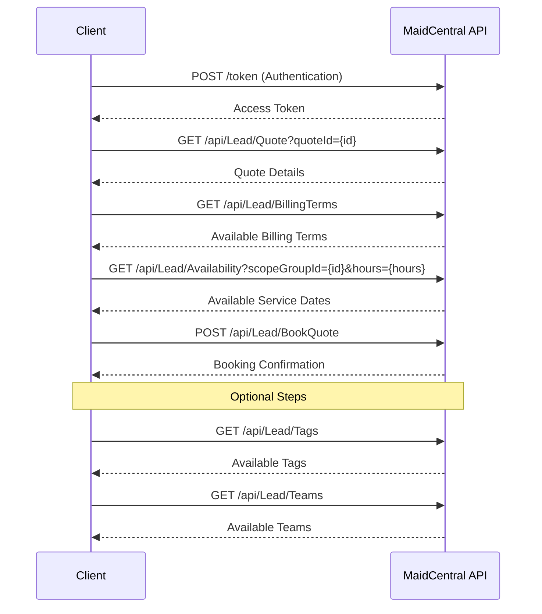

# Booking a Quote

This document outlines the process of booking a quote in the MaidCentral system. Booking a quote converts a potential customer (lead) into an actual customer with scheduled service.

## Workflow Diagram



## Step 1: Authentication

First, obtain an authentication token:

```bash
curl -X POST "https://api.maidcentral.com/token" \
  -H "Content-Type: application/x-www-form-urlencoded" \
  -d "username=your_username&password=your_password&grant_type=password"
```

Response:

```json
{
  "access_token": "eyJhbGciOiJIUzI1NiIsInR5cCI6IkpXVCJ9...",
  "token_type": "bearer",
  "expires_in": 3600,
  "refresh_token": "..."
}
```

## Step 2: Retrieve Quote Details

Get the details of the quote you want to book:

```bash
curl -X GET "https://api.maidcentral.com/api/Lead/Quote?quoteId=a1b2c3d4-e5f6-7890-abcd-ef1234567890" \
  -H "Authorization: Bearer YOUR_ACCESS_TOKEN"
```

Response:

```json
{
  "IsSuccess": true,
  "Message": null,
  "Result": [
    {
      "LeadId": 12345,
      "QuoteId": "a1b2c3d4-e5f6-7890-abcd-ef1234567890",
      "CustomerInformationId": null,
      "HomeInformationId": null,
      "FirstName": "John",
      "LastName": "Doe",
      "Email": "john.doe@example.com",
      "Phone": "555-123-4567",
      "PostalCode": "12345",
      "StatusId": 2,
      "StatusName": "Quote Created",
      "BaseSiteUrl": "https://example.maidcentral.com",
      "MaidServiceQuoteUrl": "https://example.maidcentral.com/quote/a1b2c3d4-e5f6-7890-abcd-ef1234567890",
      "BookNowUrl": "https://example.maidcentral.com/quote/a1b2c3d4-e5f6-7890-abcd-ef1234567890/book",
      "ActivateUrl": null,
      "CustomerSourceId": 1,
      "CustomerSourceName": "Website",
      "BillingTermsId": null,
      "BillingTermsName": null,
      "ScopeGroupId": 1,
      "ScopeGroupName": "Residential Cleaning",
      "Scopes": [
        {
          "ScopeId": 101,
          "ScopeName": "Regular Cleaning",
          "Frequencies": [
            {
              "IsBooked": false,
              "IsInterested": true,
              "FrequencyId": "weekly",
              "FrequencyName": "Weekly",
              "AdjustedBaseCost": 150.00,
              "CalculatedBaseCost": 150.00,
              "TotalBaseHours": 3.0,
              "TotalRecurringCost": 150.00,
              "TotalFirstJobCost": 150.00,
              "TotalRecurringHours": 3.0,
              "TotalFirstJobHours": 3.0,
              "RateModifications": [
                {
                  "Quantity": 1,
                  "RateModificationId": 201,
                  "IsRecurring": true,
                  "Name": "Pet Fee",
                  "CalculatedCost": 10.00,
                  "CalculatedHours": 0.2
                }
              ],
              "MinimumCost": 100.00
            }
          ]
        }
      ],
      "HomeSquareFeet": 2000,
      "HomeStories": 2.0,
      "HomeHasBasement": false,
      "HomeBedrooms": 3,
      "HomeFullBathrooms": 2,
      "HomeHalfBathrooms": 1,
      "HomeDirtCode": 2,
      "HomePets": 1,
      "HomePeople": 4,
      "HomeSpecialInstructions": null,
      "HomePetInstructions": null,
      "HomeSpecialEquipment": null,
      "HomeWasteDisposal": null,
      "HomeAccessInfo": null,
      "HomeAddress1": "123 Main St",
      "HomeAddress2": null,
      "HomeCity": "Anytown",
      "HomeRegion": "CA",
      "HomePostalCode": "12345",
      "BillingAddress1": "123 Main St",
      "BillingAddress2": null,
      "BillingCity": "Anytown",
      "BillingRegion": "CA",
      "BillingPostalCode": "12345",
      "PECode": null,
      "PEStartTime": null,
      "PEEndTime": null,
      "PEDaysOfWeek": null
    }
  ],
  "InnerException": null,
  "StatusCode": 200
}
```

## Step 3: Retrieve Billing Terms (Optional)

Get a list of available billing terms:

```bash
curl -X GET "https://api.maidcentral.com/api/Lead/BillingTerms" \
  -H "Authorization: Bearer YOUR_ACCESS_TOKEN"
```

Response:

```json
{
  "IsSuccess": true,
  "Message": null,
  "Result": [
    {
      "BillingTermsId": 1,
      "Name": "Credit Card"
    },
    {
      "BillingTermsId": 2,
      "Name": "Invoice"
    },
    {
      "BillingTermsId": 3,
      "Name": "ACH"
    }
  ],
  "InnerException": null,
  "StatusCode": 200
}
```

## Step 4: Retrieve Available Service Dates

Check for available service dates based on the scope group and estimated service hours:

```bash
curl -X GET "https://api.maidcentral.com/api/Lead/Availability?scopeGroupId=1&hours=3.0" \
  -H "Authorization: Bearer YOUR_ACCESS_TOKEN"
```

Response:

```json
{
  "IsSuccess": true,
  "Message": null,
  "Result": [
    "2025-05-05T09:00:00Z",
    "2025-05-05T13:00:00Z",
    "2025-05-06T09:00:00Z",
    "2025-05-06T13:00:00Z",
    "2025-05-07T09:00:00Z",
    "2025-05-07T13:00:00Z",
    "2025-05-08T09:00:00Z",
    "2025-05-08T13:00:00Z",
    "2025-05-09T09:00:00Z",
    "2025-05-09T13:00:00Z"
  ],
  "InnerException": null,
  "StatusCode": 200
}
```

### Availability Parameters

- `scopeGroupId`: ID of the scope group (required)
- `hours` or `amount`: Either the estimated hours or the amount of the service (one is required)
- `startDate`: Optional start date for availability search (default is today)
- `endDate`: Optional end date for availability search (default is 1 month from today)

## Step 5: Retrieve Tags (Optional)

Get a list of available tags that can be applied to customers, services, and jobs:

```bash
curl -X GET "https://api.maidcentral.com/api/Lead/Tags" \
  -H "Authorization: Bearer YOUR_ACCESS_TOKEN"
```

Response:

```json
{
  "IsSuccess": true,
  "Message": null,
  "Result": [
    {
      "TagId": 101,
      "Name": "VIP Customer",
      "Category": "Customer",
      "CategoryId": 3,
      "Description": "High-value customer",
      "Color": "#e74c3c",
      "Icon": "star"
    },
    {
      "TagId": 201,
      "Name": "Pet Owner",
      "Category": "Home Service",
      "CategoryId": 4,
      "Description": "Customer has pets",
      "Color": "#3498db",
      "Icon": "paw"
    },
    {
      "TagId": 301,
      "Name": "First Job",
      "Category": "Job",
      "CategoryId": 6,
      "Description": "First service for this customer",
      "Color": "#2ecc71",
      "Icon": "calendar-check"
    }
    // Additional tags...
  ],
  "InnerException": null,
  "StatusCode": 200
}
```

## Step 6: Retrieve Teams (Optional)

Get a list of available teams that can be assigned to jobs:

```bash
curl -X GET "https://api.maidcentral.com/api/Lead/Teams" \
  -H "Authorization: Bearer YOUR_ACCESS_TOKEN"
```

Response:

```json
{
  "IsSuccess": true,
  "Message": null,
  "Result": [
    {
      "TeamId": 1,
      "Name": "Team Alpha",
      "Color": "#3498db",
      "SortOrder": 1
    },
    {
      "TeamId": 2,
      "Name": "Team Beta",
      "Color": "#2ecc71",
      "SortOrder": 2
    },
    {
      "TeamId": 3,
      "Name": "Team Gamma",
      "Color": "#e74c3c",
      "SortOrder": 3
    }
  ],
  "InnerException": null,
  "StatusCode": 200
}
```

## Step 7: Book the Quote

Book the quote using the `/api/Lead/BookQuote` endpoint:

```bash
curl -X POST "https://api.maidcentral.com/api/Lead/BookQuote" \
  -H "Authorization: Bearer YOUR_ACCESS_TOKEN" \
  -H "Content-Type: application/json" \
  -d '{
    "LeadId": 12345,
    "QuoteId": "a1b2c3d4-e5f6-7890-abcd-ef1234567890",
    "SendBookedEmail": true,
    "SendCustomerPortalInvite": true,
    "AddToCampaigns": true,
    "TriggerWebhook": true,
    "ScopeGroupId": 1,
    "BillingTermsId": 1,
    "ScopesOfWork": [
      {
        "FirstJobDate": "2025-05-05T09:00:00Z",
        "FirstJobInstructions": "Please use the side entrance",
        "FirstJobTagIds": [301],
        "ServiceSetTagIds": [201],
        "TeamIds": [1],
        "ScopeOfWorkId": 101,
        "Frequency": "weekly",
        "RateModifications": [
          {
            "Quantity": 1,
            "RateModificationId": 201,
            "IsRecurring": true
          }
        ]
      }
    ],
    "CustomerTagIds": [101],
    "HomeServiceTagIds": [201]
  }'
```

Response:

```json
{
  "IsSuccess": true,
  "Message": "Quote booked successfully",
  "Result": {
    "LeadId": 12345,
    "QuoteId": "a1b2c3d4-e5f6-7890-abcd-ef1234567890",
    "CustomerInformationId": 5678,
    "HomeInformationId": 9012,
    "FirstName": "John",
    "LastName": "Doe",
    "Email": "john.doe@example.com",
    "Phone": "555-123-4567",
    "PostalCode": "12345",
    "StatusId": 3,
    "StatusName": "Booked",
    "BaseSiteUrl": "https://example.maidcentral.com",
    "MaidServiceQuoteUrl": "https://example.maidcentral.com/quote/a1b2c3d4-e5f6-7890-abcd-ef1234567890",
    "BookNowUrl": null,
    "ActivateUrl": "https://example.maidcentral.com/activate/5678/token",
    "CustomerSourceId": 1,
    "CustomerSourceName": "Website",
    "BillingTermsId": 1,
    "BillingTermsName": "Credit Card",
    "ScopeGroupId": 1,
    "ScopeGroupName": "Residential Cleaning",
    "Scopes": [
      {
        "ScopeId": 101,
        "ScopeName": "Regular Cleaning",
        "Frequencies": [
          {
            "IsBooked": true,
            "IsInterested": true,
            "FrequencyId": "weekly",
            "FrequencyName": "Weekly",
            "AdjustedBaseCost": 150.00,
            "CalculatedBaseCost": 150.00,
            "TotalBaseHours": 3.0,
            "TotalRecurringCost": 160.00,
            "TotalFirstJobCost": 160.00,
            "TotalRecurringHours": 3.2,
            "TotalFirstJobHours": 3.2,
            "RateModifications": [
              {
                "Quantity": 1,
                "RateModificationId": 201,
                "IsRecurring": true,
                "Name": "Pet Fee",
                "CalculatedCost": 10.00,
                "CalculatedHours": 0.2
              }
            ],
            "MinimumCost": 100.00
          }
        ]
      }
    ],
    "HomeSquareFeet": 2000,
    "HomeStories": 2.0,
    "HomeHasBasement": false,
    "HomeBedrooms": 3,
    "HomeFullBathrooms": 2,
    "HomeHalfBathrooms": 1,
    "HomeDirtCode": 2,
    "HomePets": 1,
    "HomePeople": 4,
    "HomeSpecialInstructions": null,
    "HomePetInstructions": null,
    "HomeSpecialEquipment": null,
    "HomeWasteDisposal": null,
    "HomeAccessInfo": null,
    "HomeAddress1": "123 Main St",
    "HomeAddress2": null,
    "HomeCity": "Anytown",
    "HomeRegion": "CA",
    "HomePostalCode": "12345",
    "BillingAddress1": "123 Main St",
    "BillingAddress2": null,
    "BillingCity": "Anytown",
    "BillingRegion": "CA",
    "BillingPostalCode": "12345",
    "PECode": "WEEKLY-MON-AM",
    "PEStartTime": "09:00:00",
    "PEEndTime": "12:00:00",
    "PEDaysOfWeek": ["Monday"]
  },
  "InnerException": null,
  "StatusCode": 200
}
```

### Required Parameters

- `LeadId`: ID of the lead
- `QuoteId`: ID of the quote to book
- `ScopeGroupId`: ID of the scope group
- `ScopesOfWork`: Array of scopes to book, each with:
  - `FirstJobDate`: Date and time for the first service
  - `ScopeOfWorkId`: ID of the scope
  - `Frequency`: Frequency of the service

### Optional Parameters

- `SendBookedEmail`: Whether to send a booking confirmation email (default: false)
- `SendCustomerPortalInvite`: Whether to send a customer portal invitation (default: false)
- `AddToCampaigns`: Whether to add to MaidCentral campaigns (default: true)
- `TriggerWebhook`: Whether to trigger configured webhooks (default: true)
- `BillingTermsId`: ID of the billing terms (default: credit card)
- `CustomerTagIds`: Array of tag IDs to apply to the customer
- `HomeServiceTagIds`: Array of tag IDs to apply to the home service
- For each scope of work:
  - `FirstJobInstructions`: Special instructions for the first job
  - `FirstJobTagIds`: Array of tag IDs to apply to the first job
  - `ServiceSetTagIds`: Array of tag IDs to apply to the service set
  - `TeamIds`: Array of team IDs to assign to the job
  - `RateModifications`: Array of rate modifications to apply
- `utm_source`, `utm_medium`, `utm_campaign`, `utm_term`, `utm_content`: UTM tracking parameters

## Complete Example

Here's a complete example of booking a quote with all available options:

```bash
# Step 1: Authenticate
TOKEN=$(curl -s -X POST "https://api.maidcentral.com/token" \
  -H "Content-Type: application/x-www-form-urlencoded" \
  -d "username=your_username&password=your_password&grant_type=password" \
  | jq -r '.access_token')

# Step 2: Get quote details
curl -s -X GET "https://api.maidcentral.com/api/Lead/Quote?quoteId=a1b2c3d4-e5f6-7890-abcd-ef1234567890" \
  -H "Authorization: Bearer $TOKEN"

# Step 3: Get billing terms
curl -s -X GET "https://api.maidcentral.com/api/Lead/BillingTerms" \
  -H "Authorization: Bearer $TOKEN"

# Step 4: Check availability
curl -s -X GET "https://api.maidcentral.com/api/Lead/Availability?scopeGroupId=1&hours=3.0" \
  -H "Authorization: Bearer $TOKEN"

# Step 5: Get tags
curl -s -X GET "https://api.maidcentral.com/api/Lead/Tags" \
  -H "Authorization: Bearer $TOKEN"

# Step 6: Get teams
curl -s -X GET "https://api.maidcentral.com/api/Lead/Teams" \
  -H "Authorization: Bearer $TOKEN"

# Step 7: Book the quote
curl -s -X POST "https://api.maidcentral.com/api/Lead/BookQuote" \
  -H "Authorization: Bearer $TOKEN" \
  -H "Content-Type: application/json" \
  -d '{
    "LeadId": 12345,
    "QuoteId": "a1b2c3d4-e5f6-7890-abcd-ef1234567890",
    "SendBookedEmail": true,
    "SendCustomerPortalInvite": true,
    "AddToCampaigns": true,
    "TriggerWebhook": true,
    "ScopeGroupId": 1,
    "BillingTermsId": 1,
    "ScopesOfWork": [
      {
        "FirstJobDate": "2025-05-05T09:00:00Z",
        "FirstJobInstructions": "Please use the side entrance",
        "FirstJobTagIds": [301],
        "ServiceSetTagIds": [201],
        "TeamIds": [1],
        "ScopeOfWorkId": 101,
        "Frequency": "weekly",
        "RateModifications": [
          {
            "Quantity": 1,
            "RateModificationId": 201,
            "IsRecurring": true
          }
        ]
      }
    ],
    "CustomerTagIds": [101],
    "HomeServiceTagIds": [201],
    "utm_source": "google",
    "utm_medium": "cpc",
    "utm_campaign": "spring_cleaning",
    "utm_term": "house cleaning services",
    "utm_content": "ad1"
  }'
```

## Next Steps

After booking a quote, you can:

1. Add notes using the `/api/Note/Create` endpoint
2. Update customer information
3. Manage scheduled services
