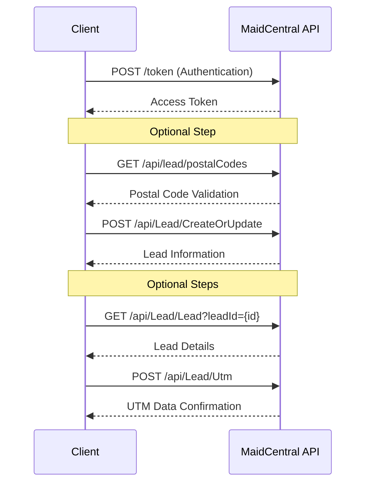

# Creating a Lead

This document outlines the process of creating a lead in the MaidCentral system. A lead represents a potential customer who has expressed interest in cleaning services.

## Workflow Diagram



## Step 1: Authentication

First, obtain an authentication token:

```bash
curl -X POST "https://api.maidcentral.com/token" \
  -H "Content-Type: application/x-www-form-urlencoded" \
  -d "username=your_username&password=your_password&grant_type=password"
```

Response:

```json
{
  "access_token": "eyJhbGciOiJIUzI1NiIsInR5cCI6IkpXVCJ9...",
  "token_type": "bearer",
  "expires_in": 3600,
  "refresh_token": "..."
}
```

## Step 2: Validate Postal Code (Optional)

Before creating a lead, you can validate the postal code to ensure it's valid and that service is available in that area:

```bash
curl -X GET "https://api.maidcentral.com/api/lead/postalCodes" \
  -H "Authorization: Bearer YOUR_ACCESS_TOKEN"
```

Response:

```json
{
  "IsSuccess": true,
  "Message": null,
  "Result": {
    "IsValid": true,
    "IsServiceAvailable": true,
    "Region": "CA",
    "City": "Anytown",
    "ServiceRegionId": 5,
    "ServiceRegionName": "West Coast",
    "PricingAdjustment": 0,
    "MinimumHours": 3.0,
    "Notes": "This area requires a minimum of 3 hours per service"
  },
  "InnerException": null,
  "StatusCode": 200
}
```

This step is optional but recommended to ensure that you're only creating leads for areas where service is available. The response provides valuable information about the service region, any pricing adjustments, and minimum service requirements for that area.

## Step 3: Create a Lead

Create a new lead using the `/api/Lead/CreateOrUpdate` endpoint:

```bash
curl -X POST "https://api.maidcentral.com/api/Lead/CreateOrUpdate" \
  -H "Authorization: Bearer YOUR_ACCESS_TOKEN" \
  -H "Content-Type: application/json" \
  -d '{
    "FirstName": "John",
    "LastName": "Doe",
    "Email": "john.doe@example.com",
    "Phone": "555-123-4567",
    "PostalCode": "12345",
    "SendLeadEmail": true,
    "AddToCampaigns": true,
    "TriggerWebhook": true,
    "Notes": "Interested in weekly cleaning service",
    "CustomerSourceId": 1
  }'
```

Response:

```json
{
  "IsSuccess": true,
  "Message": "Lead created successfully",
  "Result": {
    "LeadId": 12345,
    "CustomerInformationId": null,
    "HomeInformationId": null,
    "FirstName": "John",
    "LastName": "Doe",
    "Email": "john.doe@example.com",
    "Phone": "555-123-4567",
    "PostalCode": "12345",
    "StatusId": 1,
    "StatusName": "New Lead",
    "BaseSiteUrl": "https://example.maidcentral.com",
    "MaidServiceQuoteUrl": "https://example.maidcentral.com/quote/12345",
    "ActivateUrl": null,
    "CustomerSourceId": 1,
    "CustomerSourceName": "Website",
    "BillingTermsId": null,
    "BillingTermsName": null,
    "ScopeGroupId": null,
    "ScopeGroupName": null,
    "HomeAddress1": null,
    "HomeAddress2": null,
    "HomeCity": null,
    "HomeRegion": null,
    "HomePostalCode": "12345",
    "BillingAddress1": null,
    "BillingAddress2": null,
    "BillingCity": null,
    "BillingRegion": null,
    "BillingPostalCode": null
  },
  "InnerException": null,
  "StatusCode": 200
}
```

### Required Parameters

- `FirstName`: Customer's first name
- `LastName`: Customer's last name
- `Email`: Customer's email address
- `Phone`: Customer's phone number
- `PostalCode`: Customer's postal code (used to check service availability)

### Optional Parameters

- `SendLeadEmail`: Whether to send an email to the lead (default: true)
- `AddToCampaigns`: Whether to add the lead to MaidCentral campaigns (default: true)
- `TriggerWebhook`: Whether to trigger configured webhooks (default: true)
- `Notes`: Additional notes about the lead
- `CustomerSourceId`: Source of the lead (get valid IDs from `/api/Lead/CustomerSources`)
- `LeadTagIds`: Array of tag IDs to apply to the lead
- `utm_source`, `utm_medium`, `utm_campaign`, `utm_term`, `utm_content`: UTM tracking parameters

## Step 4: Retrieve Lead Information (Optional)

To retrieve information about an existing lead:

```bash
curl -X GET "https://api.maidcentral.com/api/Lead/Lead?leadId=12345" \
  -H "Authorization: Bearer YOUR_ACCESS_TOKEN"
```

Response:

```json
{
  "IsSuccess": true,
  "Message": null,
  "Result": [
    {
      "LeadId": 12345,
      "CustomerInformationId": null,
      "HomeInformationId": null,
      "FirstName": "John",
      "LastName": "Doe",
      "Email": "john.doe@example.com",
      "Phone": "555-123-4567",
      "PostalCode": "12345",
      "StatusId": 1,
      "StatusName": "New Lead",
      "BaseSiteUrl": "https://example.maidcentral.com",
      "MaidServiceQuoteUrl": "https://example.maidcentral.com/quote/12345",
      "ActivateUrl": null,
      "CustomerSourceId": 1,
      "CustomerSourceName": "Website",
      "BillingTermsId": null,
      "BillingTermsName": null,
      "ScopeGroupId": null,
      "ScopeGroupName": null,
      "HomeAddress1": null,
      "HomeAddress2": null,
      "HomeCity": null,
      "HomeRegion": null,
      "HomePostalCode": "12345",
      "BillingAddress1": null,
      "BillingAddress2": null,
      "BillingCity": null,
      "BillingRegion": null,
      "BillingPostalCode": null
    }
  ],
  "InnerException": null,
  "StatusCode": 200
}
```

## Step 5: Add UTM Data (Optional)

If you need to associate UTM tracking data with a lead after creation:

```bash
curl -X POST "https://api.maidcentral.com/api/Lead/Utm" \
  -H "Authorization: Bearer YOUR_ACCESS_TOKEN" \
  -H "Content-Type: application/json" \
  -d '{
    "LeadId": 12345,
    "utm_source": "google",
    "utm_medium": "cpc",
    "utm_campaign": "spring_cleaning",
    "utm_term": "house cleaning services",
    "utm_content": "ad1"
  }'
```

Response:

```json
{
  "IsSuccess": true,
  "Message": "UTM data added successfully",
  "Result": true,
  "InnerException": null,
  "StatusCode": 200
}
```

## Complete Example

Here's a complete example of creating a lead with all available options:

```bash
# Step 1: Authenticate
TOKEN=$(curl -s -X POST "https://api.maidcentral.com/token" \
  -H "Content-Type: application/x-www-form-urlencoded" \
  -d "username=your_username&password=your_password&grant_type=password" \
  | jq -r '.access_token')

# Step 2: Validate postal code (optional)
POSTAL_VALIDATION=$(curl -s -X GET "https://api.maidcentral.com/api/lead/postalCodes?postalCode=12345" \
  -H "Authorization: Bearer $TOKEN")

# Check if service is available in this area
IS_SERVICE_AVAILABLE=$(echo $POSTAL_VALIDATION | jq -r '.Result.IsServiceAvailable')
if [ "$IS_SERVICE_AVAILABLE" != "true" ]; then
  echo "Service is not available in this area"
  exit 1
fi

# Step 3: Create a lead
LEAD_RESPONSE=$(curl -s -X POST "https://api.maidcentral.com/api/Lead/CreateOrUpdate" \
  -H "Authorization: Bearer $TOKEN" \
  -H "Content-Type: application/json" \
  -d '{
    "FirstName": "John",
    "LastName": "Doe",
    "Email": "john.doe@example.com",
    "Phone": "555-123-4567",
    "PostalCode": "12345",
    "SendLeadEmail": true,
    "AddToCampaigns": true,
    "TriggerWebhook": true,
    "Notes": "Interested in weekly cleaning service",
    "CustomerSourceId": 1,
    "LeadTagIds": [101, 102],
    "utm_source": "google",
    "utm_medium": "cpc",
    "utm_campaign": "spring_cleaning",
    "utm_term": "house cleaning services",
    "utm_content": "ad1"
  }')

# Extract the lead ID from the response
LEAD_ID=$(echo $LEAD_RESPONSE | jq -r '.Result.LeadId')

# Step 4: Retrieve lead information (optional)
curl -s -X GET "https://api.maidcentral.com/api/Lead/Lead?leadId=$LEAD_ID" \
  -H "Authorization: Bearer $TOKEN"
```

## Next Steps

After creating a lead, you can:

1. [Create a quote](creating-a-quote.md) for the lead
2. Add notes using the `/api/Note/Create` endpoint
3. Update the lead with additional information
