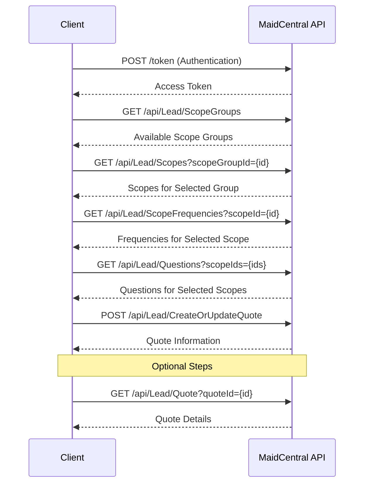

# Creating a Quote

This document outlines the process of creating a quote for a lead in the MaidCentral system. A quote represents a specific service offering with pricing for a potential customer.

## Workflow Diagram



## Step 1: Authentication

First, obtain an authentication token:

```bash
curl -X POST "https://api.maidcentral.com/token" \
  -H "Content-Type: application/x-www-form-urlencoded" \
  -d "username=your_username&password=your_password&grant_type=password"
```

Response:

```json
{
  "access_token": "eyJhbGciOiJIUzI1NiIsInR5cCI6IkpXVCJ9...",
  "token_type": "bearer",
  "expires_in": 3600,
  "refresh_token": "..."
}
```

## Step 2: Retrieve Available Scope Groups

Get a list of available scope groups (service categories):

```bash
curl -X GET "https://api.maidcentral.com/api/Lead/ScopeGroups" \
  -H "Authorization: Bearer YOUR_ACCESS_TOKEN"
```

Response:

```json
{
  "IsSuccess": true,
  "Message": null,
  "Result": [
    {
      "ScopeGroupId": 1,
      "Name": "Residential Cleaning",
      "Scopes": [
        {
          "ScopeId": 101,
          "Name": "Regular Cleaning",
          "IsRequired": true,
          "Frequencies": [
            {
              "FrequencyId": "weekly",
              "Name": "Weekly"
            },
            {
              "FrequencyId": "biweekly",
              "Name": "Bi-Weekly"
            },
            {
              "FrequencyId": "monthly",
              "Name": "Monthly"
            }
          ]
        },
        {
          "ScopeId": 102,
          "Name": "Deep Cleaning",
          "IsRequired": false,
          "Frequencies": [
            {
              "FrequencyId": "onetime",
              "Name": "One-Time"
            }
          ]
        }
      ]
    },
    {
      "ScopeGroupId": 2,
      "Name": "Commercial Cleaning",
      "Scopes": [
        // Commercial cleaning scopes...
      ]
    }
  ],
  "InnerException": null,
  "StatusCode": 200
}
```

## Step 3: Retrieve Scopes for Selected Group (Optional)

If you need more detailed information about scopes for a specific group:

```bash
curl -X GET "https://api.maidcentral.com/api/Lead/Scopes?scopeGroupId=1" \
  -H "Authorization: Bearer YOUR_ACCESS_TOKEN"
```

Response:

```json
{
  "IsSuccess": true,
  "Message": null,
  "Result": [
    {
      "ScopeId": 101,
      "Name": "Regular Cleaning",
      "IsRequired": true,
      "Frequencies": [
        {
          "FrequencyId": "weekly",
          "Name": "Weekly"
        },
        {
          "FrequencyId": "biweekly",
          "Name": "Bi-Weekly"
        },
        {
          "FrequencyId": "monthly",
          "Name": "Monthly"
        }
      ]
    },
    {
      "ScopeId": 102,
      "Name": "Deep Cleaning",
      "IsRequired": false,
      "Frequencies": [
        {
          "FrequencyId": "onetime",
          "Name": "One-Time"
        }
      ]
    }
  ],
  "InnerException": null,
  "StatusCode": 200
}
```

## Step 4: Retrieve Frequencies for a Scope (Optional)

If you need more detailed information about frequencies for a specific scope:

```bash
curl -X GET "https://api.maidcentral.com/api/Lead/ScopeFrequencies?scopeId=101" \
  -H "Authorization: Bearer YOUR_ACCESS_TOKEN"
```

Response:

```json
{
  "IsSuccess": true,
  "Message": null,
  "Result": [
    {
      "FrequencyId": "weekly",
      "Name": "Weekly"
    },
    {
      "FrequencyId": "biweekly",
      "Name": "Bi-Weekly"
    },
    {
      "FrequencyId": "monthly",
      "Name": "Monthly"
    }
  ],
  "InnerException": null,
  "StatusCode": 200
}
```

## Step 5: Retrieve Questions for Selected Scopes

Get the questions that need to be answered for the selected scopes:

```bash
curl -X GET "https://api.maidcentral.com/api/Lead/Questions?scopeIds=101&scopeIds=102" \
  -H "Authorization: Bearer YOUR_ACCESS_TOKEN"
```

Response:

```json
{
  "IsSuccess": true,
  "Message": null,
  "Result": [
    {
      "ScopeId": 101,
      "QuestionId": 1001,
      "IsRequired": true,
      "QuestionText": "How many bedrooms are in your home?",
      "Answers": [
        {
          "AnswerId": 10001,
          "AnswerText": "1-2",
          "Icon": "bedroom-small",
          "Color": "#3498db",
          "HelpText": "Small home",
          "SortOrder": 1
        },
        {
          "AnswerId": 10002,
          "AnswerText": "3-4",
          "Icon": "bedroom-medium",
          "Color": "#2ecc71",
          "HelpText": "Medium home",
          "SortOrder": 2
        },
        {
          "AnswerId": 10003,
          "AnswerText": "5+",
          "Icon": "bedroom-large",
          "Color": "#e74c3c",
          "HelpText": "Large home",
          "SortOrder": 3
        }
      ],
      "HelpText": "Please select the number of bedrooms",
      "Icon": "home",
      "Color": "#9b59b6",
      "QuestionStepType": "Initial",
      "QuestionType": "SelectList",
      "TextValue": null,
      "PricingAdjustmentDescription": "Affects base pricing",
      "SortOrder": 1
    },
    {
      "ScopeId": 101,
      "QuestionId": 1002,
      "IsRequired": true,
      "QuestionText": "How many bathrooms are in your home?",
      "Answers": [
        // Bathroom options...
      ],
      "HelpText": "Please select the number of bathrooms",
      "Icon": "bathroom",
      "Color": "#3498db",
      "QuestionStepType": "Initial",
      "QuestionType": "SelectList",
      "TextValue": null,
      "PricingAdjustmentDescription": "Affects base pricing",
      "SortOrder": 2
    }
    // Additional questions...
  ],
  "InnerException": null,
  "StatusCode": 200
}
```

## Step 6: Create a Quote

Create a new quote using the `/api/Lead/CreateOrUpdateQuote` endpoint:

```bash
curl -X POST "https://api.maidcentral.com/api/Lead/CreateOrUpdateQuote" \
  -H "Authorization: Bearer YOUR_ACCESS_TOKEN" \
  -H "Content-Type: application/json" \
  -d '{
    "LeadId": 12345,
    "HomeAddress1": "123 Main St",
    "HomeCity": "Anytown",
    "HomeRegion": "CA",
    "HomePostalCode": "12345",
    "SendQuoteEmail": true,
    "AddToCampaigns": true,
    "TriggerWebhook": true,
    "ScopeGroupId": 1,
    "ScopesOfWork": [
      {
        "ScopeOfWorkId": 101,
        "Frequency": "weekly",
        "RateModifications": [
          {
            "Quantity": 1,
            "RateModificationId": 201,
            "IsRecurring": true
          }
        ]
      }
    ],
    "Questions": [
      {
        "QuestionId": 1001,
        "Answer": "10001"
      },
      {
        "QuestionId": 1002,
        "Answer": "10011"
      }
    ]
  }'
```

Response:

```json
{
  "IsSuccess": true,
  "Message": "Quote created successfully",
  "Result": {
    "LeadId": 12345,
    "QuoteId": "a1b2c3d4-e5f6-7890-abcd-ef1234567890",
    "CustomerInformationId": null,
    "HomeInformationId": null,
    "FirstName": "John",
    "LastName": "Doe",
    "Email": "john.doe@example.com",
    "Phone": "555-123-4567",
    "PostalCode": "12345",
    "StatusId": 2,
    "StatusName": "Quote Created",
    "BaseSiteUrl": "https://example.maidcentral.com",
    "MaidServiceQuoteUrl": "https://example.maidcentral.com/quote/a1b2c3d4-e5f6-7890-abcd-ef1234567890",
    "BookNowUrl": "https://example.maidcentral.com/quote/a1b2c3d4-e5f6-7890-abcd-ef1234567890/book",
    "ActivateUrl": null,
    "CustomerSourceId": 1,
    "CustomerSourceName": "Website",
    "BillingTermsId": null,
    "BillingTermsName": null,
    "ScopeGroupId": 1,
    "ScopeGroupName": "Residential Cleaning",
    "Scopes": [
      {
        "ScopeId": 101,
        "ScopeName": "Regular Cleaning",
        "Frequencies": [
          {
            "IsBooked": false,
            "IsInterested": true,
            "FrequencyId": "weekly",
            "FrequencyName": "Weekly",
            "AdjustedBaseCost": 150.00,
            "CalculatedBaseCost": 150.00,
            "TotalBaseHours": 3.0,
            "TotalRecurringCost": 150.00,
            "TotalFirstJobCost": 150.00,
            "TotalRecurringHours": 3.0,
            "TotalFirstJobHours": 3.0,
            "RateModifications": [
              {
                "Quantity": 1,
                "RateModificationId": 201,
                "IsRecurring": true,
                "Name": "Pet Fee",
                "CalculatedCost": 10.00,
                "CalculatedHours": 0.2
              }
            ],
            "MinimumCost": 100.00
          }
        ]
      }
    ],
    "HomeSquareFeet": 2000,
    "HomeStories": 2.0,
    "HomeHasBasement": false,
    "HomeBedrooms": 3,
    "HomeFullBathrooms": 2,
    "HomeHalfBathrooms": 1,
    "HomeDirtCode": 2,
    "HomePets": 1,
    "HomePeople": 4,
    "HomeSpecialInstructions": null,
    "HomePetInstructions": null,
    "HomeSpecialEquipment": null,
    "HomeWasteDisposal": null,
    "HomeAccessInfo": null,
    "HomeAddress1": "123 Main St",
    "HomeAddress2": null,
    "HomeCity": "Anytown",
    "HomeRegion": "CA",
    "HomePostalCode": "12345",
    "BillingAddress1": "123 Main St",
    "BillingAddress2": null,
    "BillingCity": "Anytown",
    "BillingRegion": "CA",
    "BillingPostalCode": "12345",
    "PECode": null,
    "PEStartTime": null,
    "PEEndTime": null,
    "PEDaysOfWeek": null
  },
  "InnerException": null,
  "StatusCode": 200
}
```

### Required Parameters

- `LeadId`: ID of the lead (obtained from creating a lead)
- `HomeAddress1`: Service address line 1
- `HomeCity`: Service address city
- `HomeRegion`: Service address state/region (2-character code)
- `HomePostalCode`: Service address postal code
- `ScopeGroupId`: ID of the selected scope group
- `ScopesOfWork`: Array of scopes and frequencies to include in the quote
- `Questions`: Array of answers to the required questions

### Optional Parameters

- `QuoteId`: ID of an existing quote (for updates)
- `HomeAddress2`: Service address line 2
- `BillingAddress1`, `BillingAddress2`, `BillingCity`, `BillingRegion`, `BillingPostalCode`: Billing address (if different from service address)
- `SendQuoteEmail`: Whether to send an email with the quote (default: false)
- `AddToCampaigns`: Whether to add to MaidCentral campaigns (default: false)
- `TriggerWebhook`: Whether to trigger configured webhooks (default: false)
- `utm_source`, `utm_medium`, `utm_campaign`, `utm_term`, `utm_content`: UTM tracking parameters

## Step 7: Retrieve Quote Information (Optional)

To retrieve information about an existing quote:

```bash
curl -X GET "https://api.maidcentral.com/api/Lead/Quote?quoteId=a1b2c3d4-e5f6-7890-abcd-ef1234567890" \
  -H "Authorization: Bearer YOUR_ACCESS_TOKEN"
```

Response:

```json
{
  "IsSuccess": true,
  "Message": null,
  "Result": [
    {
      "LeadId": 12345,
      "QuoteId": "a1b2c3d4-e5f6-7890-abcd-ef1234567890",
      "CustomerInformationId": null,
      "HomeInformationId": null,
      "FirstName": "John",
      "LastName": "Doe",
      "Email": "john.doe@example.com",
      "Phone": "555-123-4567",
      "PostalCode": "12345",
      "StatusId": 2,
      "StatusName": "Quote Created",
      "BaseSiteUrl": "https://example.maidcentral.com",
      "MaidServiceQuoteUrl": "https://example.maidcentral.com/quote/a1b2c3d4-e5f6-7890-abcd-ef1234567890",
      "BookNowUrl": "https://example.maidcentral.com/quote/a1b2c3d4-e5f6-7890-abcd-ef1234567890/book",
      "ActivateUrl": null,
      "CustomerSourceId": 1,
      "CustomerSourceName": "Website",
      "BillingTermsId": null,
      "BillingTermsName": null,
      "ScopeGroupId": 1,
      "ScopeGroupName": "Residential Cleaning",
      "Scopes": [
        // Scope details...
      ],
      "HomeSquareFeet": 2000,
      "HomeStories": 2.0,
      "HomeHasBasement": false,
      "HomeBedrooms": 3,
      "HomeFullBathrooms": 2,
      "HomeHalfBathrooms": 1,
      "HomeDirtCode": 2,
      "HomePets": 1,
      "HomePeople": 4,
      "HomeSpecialInstructions": null,
      "HomePetInstructions": null,
      "HomeSpecialEquipment": null,
      "HomeWasteDisposal": null,
      "HomeAccessInfo": null,
      "HomeAddress1": "123 Main St",
      "HomeAddress2": null,
      "HomeCity": "Anytown",
      "HomeRegion": "CA",
      "HomePostalCode": "12345",
      "BillingAddress1": "123 Main St",
      "BillingAddress2": null,
      "BillingCity": "Anytown",
      "BillingRegion": "CA",
      "BillingPostalCode": "12345",
      "PECode": null,
      "PEStartTime": null,
      "PEEndTime": null,
      "PEDaysOfWeek": null
    }
  ],
  "InnerException": null,
  "StatusCode": 200
}
```

## Complete Example

Here's a complete example of creating a quote with all available options:

```bash
# Step 1: Authenticate
TOKEN=$(curl -s -X POST "https://api.maidcentral.com/token" \
  -H "Content-Type: application/x-www-form-urlencoded" \
  -d "username=your_username&password=your_password&grant_type=password" \
  | jq -r '.access_token')

# Step 2: Get scope groups
curl -s -X GET "https://api.maidcentral.com/api/Lead/ScopeGroups" \
  -H "Authorization: Bearer $TOKEN"

# Step 3: Get questions for selected scopes
curl -s -X GET "https://api.maidcentral.com/api/Lead/Questions?scopeIds=101&scopeIds=102" \
  -H "Authorization: Bearer $TOKEN"

# Step 4: Create a quote
QUOTE_RESPONSE=$(curl -s -X POST "https://api.maidcentral.com/api/Lead/CreateOrUpdateQuote" \
  -H "Authorization: Bearer $TOKEN" \
  -H "Content-Type: application/json" \
  -d '{
    "LeadId": 12345,
    "HomeAddress1": "123 Main St",
    "HomeCity": "Anytown",
    "HomeRegion": "CA",
    "HomePostalCode": "12345",
    "SendQuoteEmail": true,
    "AddToCampaigns": true,
    "TriggerWebhook": true,
    "ScopeGroupId": 1,
    "ScopesOfWork": [
      {
        "ScopeOfWorkId": 101,
        "Frequency": "weekly",
        "RateModifications": [
          {
            "Quantity": 1,
            "RateModificationId": 201,
            "IsRecurring": true
          }
        ]
      },
      {
        "ScopeOfWorkId": 102,
        "Frequency": "onetime"
      }
    ],
    "Questions": [
      {
        "QuestionId": 1001,
        "Answer": "10001"
      },
      {
        "QuestionId": 1002,
        "Answer": "10011"
      }
    ],
    "utm_source": "google",
    "utm_medium": "cpc",
    "utm_campaign": "spring_cleaning",
    "utm_term": "house cleaning services",
    "utm_content": "ad1"
  }')

# Extract the quote ID from the response
QUOTE_ID=$(echo $QUOTE_RESPONSE | jq -r '.Result.QuoteId')

# Step 5: Retrieve quote information (optional)
curl -s -X GET "https://api.maidcentral.com/api/Lead/Quote?quoteId=$QUOTE_ID" \
  -H "Authorization: Bearer $TOKEN"
```

## Next Steps

After creating a quote, you can:

1. [Book the quote](booking-a-quote.md) to convert it into a scheduled service
2. Update the quote with additional information
3. Add notes using the `/api/Note/Create` endpoint
