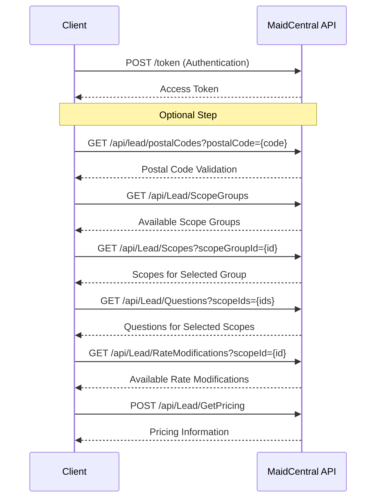

# Standalone Pricing

This document outlines the process of getting pricing information from the MaidCentral API without creating a lead. This is useful for providing quick price estimates to potential customers before collecting their contact information.

## Workflow Diagram



## Step 1: Authentication

First, obtain an authentication token:

```bash
curl -X POST "https://api.maidcentral.com/token" \
  -H "Content-Type: application/x-www-form-urlencoded" \
  -d "username=your_username&password=your_password&grant_type=password"
```

Response:

```json
{
  "access_token": "eyJhbGciOiJIUzI1NiIsInR5cCI6IkpXVCJ9...",
  "token_type": "bearer",
  "expires_in": 3600,
  "refresh_token": "..."
}
```

## Step 2: Validate Postal Code (Optional)

Before getting pricing information, you can validate the postal code to ensure it's valid and that service is available in that area:

```bash
curl -X GET "https://api.maidcentral.com/api/lead/postalCodes?postalCode=12345" \
  -H "Authorization: Bearer YOUR_ACCESS_TOKEN"
```

Response:

```json
{
  "IsSuccess": true,
  "Message": null,
  "Result": {
    "IsValid": true,
    "IsServiceAvailable": true,
    "Region": "CA",
    "City": "Anytown",
    "ServiceRegionId": 5,
    "ServiceRegionName": "West Coast",
    "PricingAdjustment": 0,
    "MinimumHours": 3.0,
    "Notes": "This area requires a minimum of 3 hours per service"
  },
  "InnerException": null,
  "StatusCode": 200
}
```

This step is optional but recommended to ensure that you're only requesting pricing for areas where service is available. The response provides valuable information about the service region, any pricing adjustments, and minimum service requirements for that area.

## Step 3: Retrieve Available Scope Groups

Get a list of available scope groups (service categories):

```bash
curl -X GET "https://api.maidcentral.com/api/Lead/ScopeGroups" \
  -H "Authorization: Bearer YOUR_ACCESS_TOKEN"
```

Response:

```json
{
  "IsSuccess": true,
  "Message": null,
  "Result": [
    {
      "ScopeGroupId": 1,
      "Name": "Residential Cleaning",
      "Scopes": [
        {
          "ScopeId": 101,
          "Name": "Regular Cleaning",
          "IsRequired": true,
          "Frequencies": [
            {
              "FrequencyId": "weekly",
              "Name": "Weekly"
            },
            {
              "FrequencyId": "biweekly",
              "Name": "Bi-Weekly"
            },
            {
              "FrequencyId": "monthly",
              "Name": "Monthly"
            }
          ]
        },
        {
          "ScopeId": 102,
          "Name": "Deep Cleaning",
          "IsRequired": false,
          "Frequencies": [
            {
              "FrequencyId": "onetime",
              "Name": "One-Time"
            }
          ]
        }
      ]
    },
    {
      "ScopeGroupId": 2,
      "Name": "Commercial Cleaning",
      "Scopes": [
        // Commercial cleaning scopes...
      ]
    }
  ],
  "InnerException": null,
  "StatusCode": 200
}
```

## Step 4: Retrieve Scopes for Selected Group (Optional)

If you need more detailed information about scopes for a specific group:

```bash
curl -X GET "https://api.maidcentral.com/api/Lead/Scopes?scopeGroupId=1" \
  -H "Authorization: Bearer YOUR_ACCESS_TOKEN"
```

Response:

```json
{
  "IsSuccess": true,
  "Message": null,
  "Result": [
    {
      "ScopeId": 101,
      "Name": "Regular Cleaning",
      "IsRequired": true,
      "Frequencies": [
        {
          "FrequencyId": "weekly",
          "Name": "Weekly"
        },
        {
          "FrequencyId": "biweekly",
          "Name": "Bi-Weekly"
        },
        {
          "FrequencyId": "monthly",
          "Name": "Monthly"
        }
      ]
    },
    {
      "ScopeId": 102,
      "Name": "Deep Cleaning",
      "IsRequired": false,
      "Frequencies": [
        {
          "FrequencyId": "onetime",
          "Name": "One-Time"
        }
      ]
    }
  ],
  "InnerException": null,
  "StatusCode": 200
}
```

## Step 5: Retrieve Questions for Selected Scopes

Get the questions that need to be answered for the selected scopes:

```bash
curl -X GET "https://api.maidcentral.com/api/Lead/Questions?scopeIds=101&scopeIds=102" \
  -H "Authorization: Bearer YOUR_ACCESS_TOKEN"
```

Response:

```json
{
  "IsSuccess": true,
  "Message": null,
  "Result": [
    {
      "ScopeId": 101,
      "QuestionId": 1001,
      "IsRequired": true,
      "QuestionText": "How many bedrooms are in your home?",
      "Answers": [
        {
          "AnswerId": 10001,
          "AnswerText": "1-2",
          "Icon": "bedroom-small",
          "Color": "#3498db",
          "HelpText": "Small home",
          "SortOrder": 1
        },
        {
          "AnswerId": 10002,
          "AnswerText": "3-4",
          "Icon": "bedroom-medium",
          "Color": "#2ecc71",
          "HelpText": "Medium home",
          "SortOrder": 2
        },
        {
          "AnswerId": 10003,
          "AnswerText": "5+",
          "Icon": "bedroom-large",
          "Color": "#e74c3c",
          "HelpText": "Large home",
          "SortOrder": 3
        }
      ],
      "HelpText": "Please select the number of bedrooms",
      "Icon": "home",
      "Color": "#9b59b6",
      "QuestionStepType": "Initial",
      "QuestionType": "SelectList",
      "TextValue": null,
      "PricingAdjustmentDescription": "Affects base pricing",
      "SortOrder": 1
    },
    {
      "ScopeId": 101,
      "QuestionId": 1002,
      "IsRequired": true,
      "QuestionText": "How many bathrooms are in your home?",
      "Answers": [
        // Bathroom options...
      ],
      "HelpText": "Please select the number of bathrooms",
      "Icon": "bathroom",
      "Color": "#3498db",
      "QuestionStepType": "Initial",
      "QuestionType": "SelectList",
      "TextValue": null,
      "PricingAdjustmentDescription": "Affects base pricing",
      "SortOrder": 2
    }
    // Additional questions...
  ],
  "InnerException": null,
  "StatusCode": 200
}
```

## Step 6: Retrieve Rate Modifications (Optional)

Get a list of available rate modifications for a specific scope:

```bash
curl -X GET "https://api.maidcentral.com/api/Lead/RateModifications?scopeId=101" \
  -H "Authorization: Bearer YOUR_ACCESS_TOKEN"
```

Response:

```json
{
  "IsSuccess": true,
  "Message": null,
  "Result": [
    {
      "RateModificationId": 201,
      "Name": "Pet Fee",
      "Description": "Additional fee for homes with pets",
      "IsPercentage": false,
      "IsRequired": false,
      "ScopeId": 101,
      "Cost": 10.00,
      "CostDisplay": "$10.00",
      "CostCalcType": 0,
      "CostCalcDescription": "Flat Fee"
    },
    {
      "RateModificationId": 202,
      "Name": "Extra Bedroom",
      "Description": "Additional fee for each bedroom beyond 3",
      "IsPercentage": false,
      "IsRequired": false,
      "ScopeId": 101,
      "Cost": 15.00,
      "CostDisplay": "$15.00",
      "CostCalcType": 0,
      "CostCalcDescription": "Flat Fee"
    },
    {
      "RateModificationId": 203,
      "Name": "New Customer Discount",
      "Description": "10% discount for new customers",
      "IsPercentage": true,
      "IsRequired": false,
      "ScopeId": 101,
      "Cost": -10.00,
      "CostDisplay": "-10%",
      "CostCalcType": 1,
      "CostCalcDescription": "Percentage"
    }
  ],
  "InnerException": null,
  "StatusCode": 200
}
```

## Step 7: Get Pricing

Get pricing information using the `/api/Lead/GetPricing` endpoint:

```bash
curl -X POST "https://api.maidcentral.com/api/Lead/GetPricing" \
  -H "Authorization: Bearer YOUR_ACCESS_TOKEN" \
  -H "Content-Type: application/json" \
  -d '{
    "PostalCode": "12345",
    "ScopeGroupId": 1,
    "ScopesOfWork": [
      {
        "ScopeOfWorkId": 101,
        "Frequency": "weekly",
        "RateModifications": [
          {
            "Quantity": 1,
            "RateModificationId": 201,
            "IsRecurring": true
          }
        ]
      },
      {
        "ScopeOfWorkId": 102,
        "Frequency": "onetime"
      }
    ],
    "Questions": [
      {
        "QuestionId": 1001,
        "Answer": "10001"
      },
      {
        "QuestionId": 1002,
        "Answer": "10011"
      }
    ]
  }'
```

Response:

```json
{
  "IsSuccess": true,
  "Message": null,
  "Result": [
    {
      "ScopeId": 101,
      "ScopeName": "Regular Cleaning",
      "Frequencies": [
        {
          "IsBooked": false,
          "IsInterested": false,
          "FrequencyId": "weekly",
          "FrequencyName": "Weekly",
          "AdjustedBaseCost": 150.00,
          "CalculatedBaseCost": 150.00,
          "TotalBaseHours": 3.0,
          "TotalRecurringCost": 160.00,
          "TotalFirstJobCost": 160.00,
          "TotalRecurringHours": 3.2,
          "TotalFirstJobHours": 3.2,
          "RateModifications": [
            {
              "Quantity": 1,
              "RateModificationId": 201,
              "IsRecurring": true,
              "Name": "Pet Fee",
              "CalculatedCost": 10.00,
              "CalculatedHours": 0.2
            }
          ],
          "MinimumCost": 100.00
        }
      ]
    },
    {
      "ScopeId": 102,
      "ScopeName": "Deep Cleaning",
      "Frequencies": [
        {
          "IsBooked": false,
          "IsInterested": false,
          "FrequencyId": "onetime",
          "FrequencyName": "One-Time",
          "AdjustedBaseCost": 250.00,
          "CalculatedBaseCost": 250.00,
          "TotalBaseHours": 5.0,
          "TotalRecurringCost": 250.00,
          "TotalFirstJobCost": 250.00,
          "TotalRecurringHours": 5.0,
          "TotalFirstJobHours": 5.0,
          "RateModifications": [],
          "MinimumCost": 200.00
        }
      ]
    }
  ],
  "InnerException": null,
  "StatusCode": 200
}
```

### Required Parameters

- `ScopeGroupId`: ID of the selected scope group
- `ScopesOfWork`: Array of scopes and frequencies to include in the pricing
- `Questions`: Array of answers to the required questions

### Optional Parameters

- `PostalCode`: Postal code to check for service availability and pricing

## Complete Example

Here's a complete example of getting standalone pricing:

```bash
# Step 1: Authenticate
TOKEN=$(curl -s -X POST "https://api.maidcentral.com/token" \
  -H "Content-Type: application/x-www-form-urlencoded" \
  -d "username=your_username&password=your_password&grant_type=password" \
  | jq -r '.access_token')

# Step 2: Validate postal code (optional)
POSTAL_VALIDATION=$(curl -s -X GET "https://api.maidcentral.com/api/lead/postalCodes?postalCode=12345" \
  -H "Authorization: Bearer $TOKEN")

# Check if service is available in this area
IS_SERVICE_AVAILABLE=$(echo $POSTAL_VALIDATION | jq -r '.Result.IsServiceAvailable')
if [ "$IS_SERVICE_AVAILABLE" != "true" ]; then
  echo "Service is not available in this area"
  exit 1
fi

# Step 3: Get scope groups
curl -s -X GET "https://api.maidcentral.com/api/Lead/ScopeGroups" \
  -H "Authorization: Bearer $TOKEN"

# Step 4: Get questions for selected scopes
curl -s -X GET "https://api.maidcentral.com/api/Lead/Questions?scopeIds=101&scopeIds=102" \
  -H "Authorization: Bearer $TOKEN"

# Step 5: Get rate modifications for a scope
curl -s -X GET "https://api.maidcentral.com/api/Lead/RateModifications?scopeId=101" \
  -H "Authorization: Bearer $TOKEN"

# Step 6: Get pricing
curl -s -X POST "https://api.maidcentral.com/api/Lead/GetPricing" \
  -H "Authorization: Bearer $TOKEN" \
  -H "Content-Type: application/json" \
  -d '{
    "PostalCode": "12345",
    "ScopeGroupId": 1,
    "ScopesOfWork": [
      {
        "ScopeOfWorkId": 101,
        "Frequency": "weekly",
        "RateModifications": [
          {
            "Quantity": 1,
            "RateModificationId": 201,
            "IsRecurring": true
          },
          {
            "Quantity": 1,
            "RateModificationId": 203,
            "IsRecurring": true
          }
        ]
      },
      {
        "ScopeOfWorkId": 102,
        "Frequency": "onetime"
      }
    ],
    "Questions": [
      {
        "QuestionId": 1001,
        "Answer": "10001"
      },
      {
        "QuestionId": 1002,
        "Answer": "10011"
      },
      {
        "QuestionId": 1003,
        "Answer": "10021"
      },
      {
        "QuestionId": 1004,
        "Answer": "10031"
      }
    ]
  }'
```

## Comparing Multiple Frequencies

A common use case is to compare pricing for different frequencies. Here's an example of getting pricing for multiple frequencies of the same scope:

```bash
curl -s -X POST "https://api.maidcentral.com/api/Lead/GetPricing" \
  -H "Authorization: Bearer $TOKEN" \
  -H "Content-Type: application/json" \
  -d '{
    "PostalCode": "12345",
    "ScopeGroupId": 1,
    "ScopesOfWork": [
      {
        "ScopeOfWorkId": 101,
        "Frequency": "weekly"
      },
      {
        "ScopeOfWorkId": 101,
        "Frequency": "biweekly"
      },
      {
        "ScopeOfWorkId": 101,
        "Frequency": "monthly"
      }
    ],
    "Questions": [
      {
        "QuestionId": 1001,
        "Answer": "10001"
      },
      {
        "QuestionId": 1002,
        "Answer": "10011"
      }
    ]
  }'
```

This will return pricing information for weekly, bi-weekly, and monthly frequencies of the Regular Cleaning scope, allowing you to present a comparison to the customer.

## Next Steps

After getting pricing information, you can:

1. [Create a lead](creating-a-lead.md) to capture the customer's contact information
2. [Create a quote](creating-a-quote.md) based on the pricing information
3. Present the pricing information to the customer through your application
